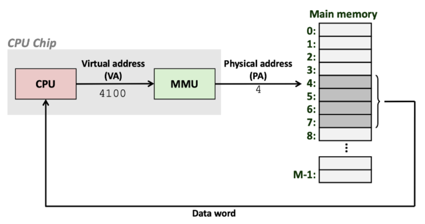
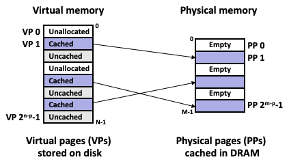
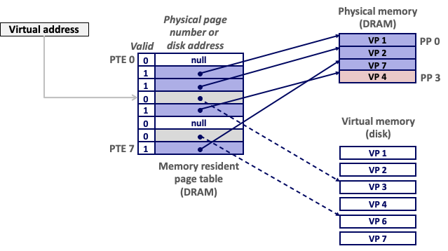
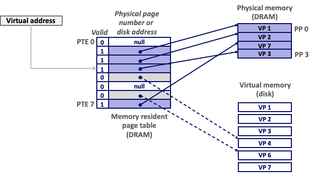
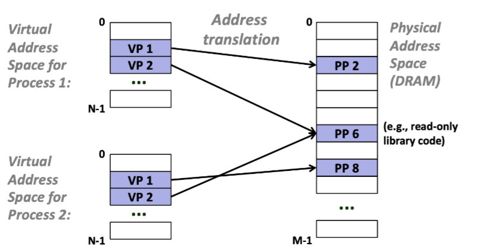
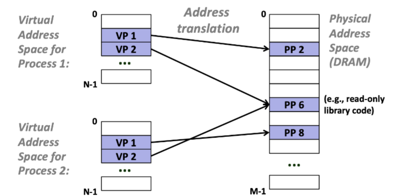
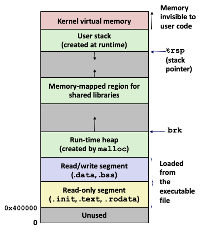

# 13. Virtual Memory: Concepts

# Address spaces

## A System Using Physical Addressing

- address space : 주소 공간
    1. process가 보는 address space -> virtual address
    2. Physical memory가 보는 -> physical address

CPU입장에서 보자.

- CPU가 main memory 접근을 하게 되면 CPU가 addressing하는 주소는 physical address에 해당하는 주소에 있는 data를 load/store할 수 있게 한다
    - ex. Physical memory고 load 를 통해 word를 가지고 옴
    - → Used in “simple” systems like embedded microcontrollers in devices like cars, elevators, and digital picture frames Physical address (PA) CPU 4 3 ...
CPU가 볼 때 물리적으로 load/store하며 수행하는 simple한 system에서 활용
- VM지원하지 않는 경우에는 physical memory로 활용 (VM 개념자체가 없다)

## A System Using Virtual Addressing

- CPU에서 virutal addreessing : 접근하는 주소가 virtual address (Not Physical addressing)
- MMU : (memory managing unit) : 4100번지에서 load/store한다고 하면 physical address로 변환해 주는 HW (CPU안에 들어가 잇음)
    - Microcontrolloer 처럼 사실 CPU가 굉장히 간단했는데 VM 해주는 system에서는 CPU chip 자체가 앞에 있는 것 보다 복잡해졌는데, virtual address를 physical address로 변환해주는 역할을 MMU에서 수행(4100(VA) - 4(PA))
    - Used in all modern servers, laptops, and smart phones
    - One of the great ideas in computer science M-1: ...

## Address Spaces

어떻게 va-> pa 변환될까?일단 정의부터 살펴보자.

- Linear address space:
    - 순서화 되어 있는 음수가 아닌 continguous한 정수 주소
    - Ordered set of contiguous non-negative integer addresses
    - $\{0, 1, 2, 3 ... \}$
- Virtual address space:
    - n개의 bit로 표현한다고 하면 N = 2^n만큼으로
    - Set of N = 2n virtual addresses
    - $\{0, 1, 2, 3, ..., N-1\}$
        - ex. $n=4$면 $N = 2^4 = 16$이므로 {0 ~ 15}까지 VA로 표현됨
- Physical address space:
    - 물리적인 주소로 표현
    - VA>PA인 경우가 많음 (일반 modern PC에서는) 
        - VA를 PA로 표현하기 위한 $N > M (N!=M)$
    - Set of M = 2m physical addresses
    - $\{0, 1, 2, 3, ..., M-1\}$

## Why Virtual Memory (VM)?
> (의문) Linear address 그냥 쓰면 되는데 왜 VA/PA 쓰는 것일까?
- **Uses main memory efficiently 
 DRAM을 좀 더 효과적으로 사용하기 위하여 VM 사용**
    - Use DRAM as a cache for parts of a virtual address space
    - VA의 일부만 DRAM에 올려 둔다 : process 공부할 때 text/ data /heap/ stack도 있고, 실제 process가 보는 virtual한 space
    - 실제 program이 수행되면 .text, .data, .heap, .stack이 있을 것이고 중간에 memory map이 존재할 것이다.
    - 프로그램이 실행되면 text나 data의 경우에도 time의 축에서 VM의 모든 구역을 다 memory에 올려둘 필요 없이 필요에 따라 DRAM에 올려 둔 main memory 공간을 cache: 특정 w time 구간동안 접근.
    - VA에 해당하는 모든 주소 공간에 있는 것들을 모드 memory에 올려놓을 필요는 없고, 자주/많이 접근되는 부분들만 VA일부로 하여 올려두겠다. DRAM은 정말 비싼 자원이기에 정말 필요한 것만 올려두는 역할을 수행하도록 한다.
    - 그냥 물리적 주소였다면 그냥 memory mapping을 하면 됨
- Simplifies memory management
    - Each process gets the same uniform linear address space
    - 0~특정한 값까지 동일하게
    - 모든 process가 자기가 접근하는 VA의 값을 0~특정 공간까지 관리할 수 있도록 해 주자
- Isolates address spaces
    - One process can’t interfere with another’s memory
    - User program cannot access privileged kernel information and code 6
    - address space를 각 process마다 자신의 address space만 사용하게 고립시키자 :서로 isolate되어 있어 서로의 영역에 대해 접근할 수 없게 한다.
        - → 다른 process의 memory와 interference (접근 못하게) 방지
    - kernel은 접근할 수 있지만 process끼리는 서로 접근 못하게 하고 process는 kernel 정보를 touch하지 못하게 하여 access/modify 못 하게 해주기 위해 필요한 기술 중 하나.

# VM as a Tool for Caching
- Conceptually, **virtual memory** is an array of N contiguous bytes stored on disk.
    - **개념적으로 어떻게 표현할 것인가**
        - process가 보는 memory = VM
        - conceptually, process가 실제 memory에 올라와 구동되게 되는데, 개념적으로 VM이라는 것은 disk 공간에서 n개의 연속된 byte array로 보겠다는 것이다.
        - = 어떤 process가 있다고 하면 contiguous한 linear addreess (0~)
    - 4KB/8KB page : 동일한 page들을 가상 주소가 disk에 mapping되어 있는 연속된 n개의 byte array로 표현한다고 가정하고 생각을 해 보면 실제 main memory에 올라온 physical memory 영역에서는 cached 부분만 올라옴
    - 그리고 실제 main memory에 있는 공간은 : VM에 0번지 ~ N-1번지 까지 N개의 page가 있었다고 하면, PM에 0 ~ M-1번지, M<N
    - > 실제 가상 memory의 특정 page들이 사용되서 main meory에 mapping되어 올라와 있는 경우에 다음처럼 보인다. 나머지는 empty된 상태이다.
    - 물리적 메모리를 가져다 가상 메모리의 cache처럼 본다.
- The contents of the array on disk are cached in **physical memory (DRAM cache)**
    - These cache blocks are called pages (size is P = 2p bytes)
    - DRAM Cache : disk에 있다고 하면 (virtual page )
    - main memory에 있는 건 DRAM에 있는 disk 주소 공간의 cache (physical page)
    - 활성화된 active page들만 memory에 올라와 있음
    - > virtual memory를 cacheingg하기 위한 tool이라고 볼 수 있다!

## DRAM Cache Organization

- Fixed 크기의 block : page / block이라고 이야기함
- PP에서 cached page 제외 나머지 empty공간을 내가 못 쓴다고 하면 다른 녀석을 가져다 caching하게 될 때 누군가를 쫓아내야 함 -> 굉장히 복잡하지만 그 알고리즘도 overhead가 됨
- cached page에 대해 mapping function 관리
- DRAM cache organization driven by the enormous miss penalty
    - DRAM is about 10x slower than SRAM
    - Disk is about 10,000x slower than DRAM
- Consequences
    - Large page (block) size: typically 4 KB, sometimes 4 MB
        - page는 통상적으로 4KB (가끔 4MB)
    - Fully associative
        - Any VP can be placed in any PP
        - Requires a “large” mapping function – different from cache memories
            - virtual page들을 physical page로 mapping할 수 있는데 어느 VP도 어느 PP로 들어갈 수 있다.  = CPU Cache는 VP가 물리적 slot에 어디나 들어가도 된다
    - Highly sophisticated, expensive replacement algorithms
        - Too complicated and open-ended to be implemented in hardware
    - Write-back rather than write-through 9
        - write 하게 되면 cache에 있는 page가 있어 실제 disk공간에 있는 page들인데
        - (1) write through 
            - PP를 씀과 동시에 같이 쓸 것이냐
        - (2) write back
            - PP에 먼저 쓰고 나중에 evict할 때 VP와 동기화 할 것이냐
            - 먼저 DRAM(cache)에 있는 것을 써 놓고 나중에 disk 공간에 있는 page가 evict될 때 VP와 동기화하여 씀
            - VM 개념을 도입했는데 실제 구현하려면
            - CPU 밖의 main memory를 이야기 중.
- SRAM Cache는 CPU안에 있음
    - HW로도 구현 : main memory중 어떤 memory에 cache한다고 할 때 누구를 쫓아내는가 등은 실제 program이 실행 될 때 cycle을 많이 소요 -> HW로 faster 구현
    - SRAM>DRAM>Disk
    - SRAM Cache : CPU chip안에 있는 processor cache가 hw적으로 설계됨
        - CPU안에서 instruction fetch할 때 활용
        - $(L1, L2)$ : cpu chip 안에 있어서 on chip cache
        - $(L3)$ : off chip cache - 바로 밖에 붙어 있음
    - DRAM : CPU 밖 memory, l3 옆 가장 붙어 있는 memory

## Enabling Data Structure: Page Table

- A **page table** is an array of page table entries (PTEs) that maps virtual pages to physical pages.
    - 앞에 있었던(8) : VA->PA로 mapping function
    - 무언가 어쨌든 이 주소를 VP1이 PP1에 mapping되어있다는 정보 + page들의 mapping 정보. 다시 말하면 어떤 page들이 어떤 물리적 page에 mapping되어 있는가에 대한 정보가 필요함. 이를 관리하기 위한 table이 page table
    - inear table의 entry가 VA를 PA로 변환해주는 역할을 수행(translator) 
        - page : 각각의 memory에서의 물리적인 공간
    - 일정 크기의 page (block)을 mapping하기 위한 entry가 table에 들어가 있음
    - Entry는 가상 주소에 해당하며 이를 보게 되면 0번부터 N에 해당하는 index에서 N=8이라고 하면 PTE 0~7,
    - page : unallocated/ cached / uncached … 
        - process 공간에서 data와 text로 보게 되고 heap을 쓰게 되면 위로 올라감/ 중간에 allcoate되지 않는 공간이 있을 것임. 
        - 영역을 할당하게 되면 위쪽PTE=0이 text/code, n-1쪽으로부터 heap이 쭉 올라간다고 보면 됨
    - entry안의 내용을 보게 되면 실제 physical page number가 들어가 있음
    - process마다 가지고 있는 OS의 data structure: OS Kernel DS로서 10개 프로세스에 해당하는 다음과 같은 table을 process마다 가지고 있음
    - Per-process kernel data structure in DRAM
    
- 질문
    - CPU 개수랑은 완전히 orthogonal : process 개수 만큼
    - page table size : 1MB/4MB (OS시간에 배움)
    - page table 자체가 DRAM에 저장됨. 자체 주소는 process의
        - process마다 process control block이라고 해서 자료구조가 있는데 여기서 page table에 대한 주소를 가지고 있음. 그 주소에 대한 page table이 선형적으로 들어가 있고, 나중에는 base line register에다가 process가 context switch될 때 주소를 가져다 넣는다.
    - > Page Table은 kernel이 보는 것이고, kernel은 physical 주소를 본다. Virtual 주소도 보기는 하지만 physical 주소와도 1대1 대응하기에 Page table자체의 주소는 물리주소로 저장된다고 봐도 될 듯.
    - fork하면 child process는 parent process와 같은 page table을 공유하는가? 그럼 같은 virtual memory가 서로 다른 physical memory를 가리키게 되는가? -> page table이 복제되는데 새로은 page table로 update됨 (공유하지 않음) 부모 것 하나, 자식 것 하나 각각 따로따로 가지고 있음. 즉, 서로 다른 physical memory를 가리키게 됨.
- (PM) 실제 physically mapped : cached 영역 (1,2,7,4) to PP 0,1,2,3
- (VM) unallocate / allocate되어 있지만 아직 cached 안 됨
- page table을 통해서 주소 변환
    - →Disk공간이라고 봐도 되고
page table을 통하여 주소 변환을 해 주는 역할을 감당하게 된다.

## Page Hit

- Page hit: reference to VM word that is in physical memory (DRAM cache hit)
- 나중에 VM을 가지고 mem copy를 한다고 하면 다른 VM으로 copy하게 되는데 그 주소는 ‘VA’
    - 결국 내부적으로는 PA를 접근해야 한다. OS기저로 들어가면 내부 변환 작업을 수행해주어야 한다.
    - 가상 주소가 DRAM에 있는가, Disk에 있는가는 page table 앞의 validity를 본다.
        - 1인경우에만 main memory에 올라가 있는 형태: DRAM Cache에서 hit가 일어나서 DRAM에 접근하면 됨
        - 0인경우: allocate 안 되어 있거나 VA가 실제 disk에 연결
- 해당하는 Validty를 확인한 후 DRAM Cache를 뒤져봄
    - Fault 발생
    - 실제 접근했는데 접근하는 Page의 validity가 0으로 되어 있음 : physical하게 dram cache에 있는 게 아니라 dram cache에 있음

## Page Fault

- Page fault: reference to VM word that is not in physical memory (DRAM cache miss)
    - Page가 없기 때문에 page missing →fault handling 필요
    
    

### Handling Page Fault

- Page miss causes page fault (an exception)
---
- Page Fault Handler가
    - PP 0~3 중 모종의 이유로 PP3을 쫓아내겠다고 결정 (evict)
    - evict하게 될 때 VP4는 VM으로, VP3은 PM으로 이동
    - 3번이 올라왔으니깐 virtual page number 3번으로 이동하게 된다. 이러한 어떤 작업을 수행해주어야 한다.
    - → Fault가 나오게 되면 누군가를 evict시켜주고 page table 을 update해주어야 한다. (4를 disk mapping, 3은 DRAM에 mapping)
- demand paging
- 누군가를 evict하고 누군가를 가져와야 함
- Page miss causes page fault (an exception)
    
- Page fault handler selects a victim to be evicted (here VP 4)
    
    
- Offending instruction is restarted : page hit
    

## Allocating Pages

- Allocating a new page (VP 5) of virtual memory.    
    
    

---

## Locality to the Rescue Again!

- Virtual memory seems terribly inefficient, but it works because of locality.
- At any point in time, programs tend to access a set of active virtual pages called the **working set**
    - Programs with better temporal locality will have smaller working sets
    - process 관점에서 봤을 때, VA를 PA로 바꾸어 주는 과정 자체가
    내가 접근되는 memory주소에 따라서 어떤 놈은 DRAM, 어떤 놈은 DIsk에 있기 때문에 handling overhead가 상당히 큼
        - → working set : 가상 메모리 페이지들의 집합.
- If (working set size < main memory size)
Working set < 내가 가진 main memory size
    - Good performance for one process after compulsory misses
    (Page fault가 발생하지 않을 것이니까)
- If ( SUM(working set sizes) > main memory size )
Working set > 내가 가진 main memory size
    - **Thrashing:** Performance meltdown where pages are swapped (copied) in and out continuously 18
    - working set이 커지게 되면 thrashing문제 발생 : 자꾸 disk mapping / dram 이랬다 저랬다 하면 disk 접근 때문에 발생하게 된다. (어떤 페이지가 in and out from disk -> 성능이 완전히 melt down된다)
- cache size라는 것은 어느정도 적당한 크기로 보장되어야 함.
    - CPU 성능도 중요하지만 메모리 성능이 중요한 이유이다: 여러 프로그램을 돌리기 때문에 각 process마다 지금과 같은 process마다 dram cache영역이 확보되어야 한다. 
    - 구동시키는 프로그램(웹/다양한 프로그램)들로 인한 in n out으로 인해  thrashing 이 발생하여 속도가 완전히 죽어버림.
        - → 가급적이면 memory 큰 pc를 구입
    

# VM as a Tool for Memory Management

## Key idea: each process has its own virtual address space

- It can view memory as a simple linear array
- Mapping function scatters addresses through physical memory
    - Well-chosen mappings can improve locality
    
    

VM as a Tool for Memory Management

- **Simplifying memory allocation**
    - Each virtual page can be mapped to any physical page
    - A virtual page can be stored in different physical pages at different times
- Sharing code and data among processes
    - Map virtual pages to the same physical page (here: PP 6)

## Simplifying Linking and Loading

- Linking
    - Each program has similar virtual address space
    - Code, data, and heap always start at the same addresses.
- Loading
    - `execve` allocates virtual pages brk for .text and .data sections & creates PTEs marked as invalid
    - The `.text` and `.data` sections are copied, page by page, on demand by the virtual memory system

# VM as a Tool for Memory Protection

- Extend PTEs with Permission bits
- MMU checks these bits on each access