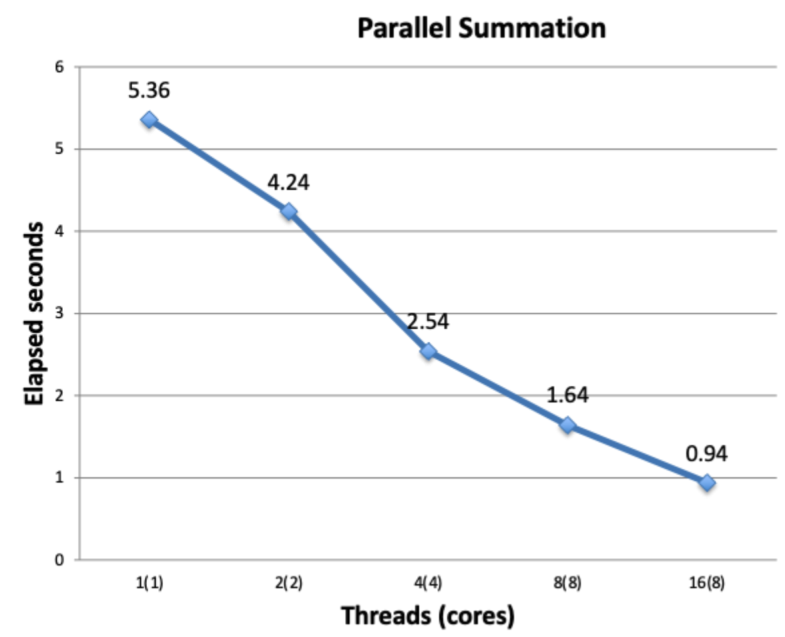
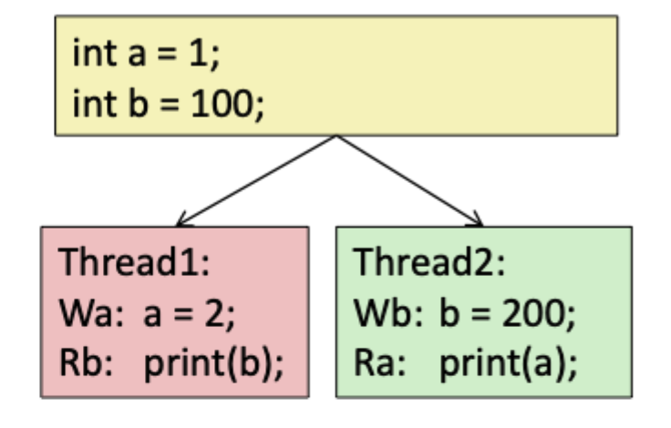
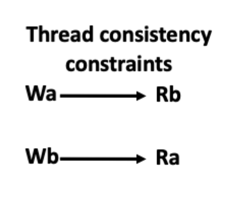
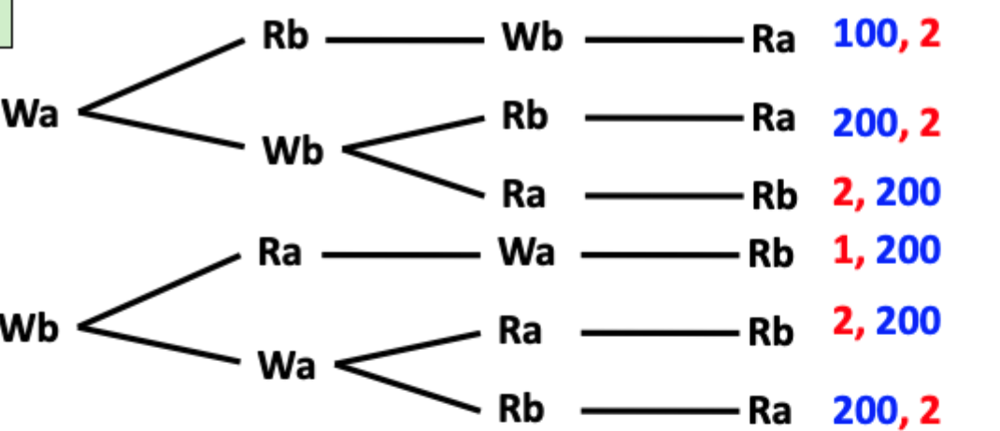
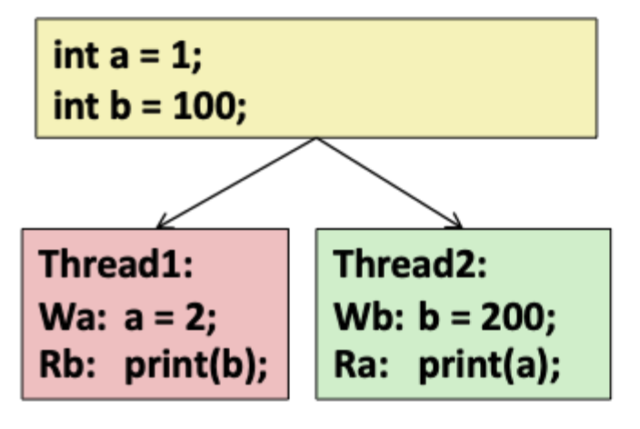
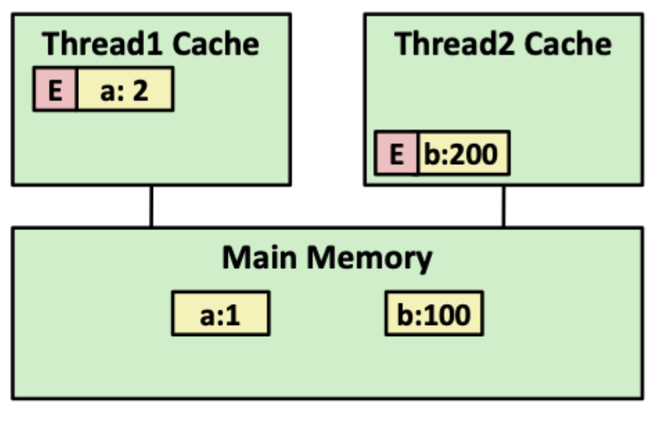
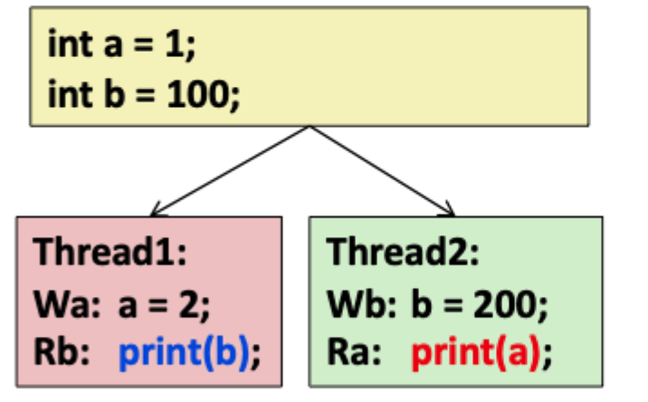

# 9. Thread-Level Parallelism

# Today

- Parallel Computing Hardware
    - Multicore
    - Multiple separate processors on single chip
    - Hyperthreading
    - Efficient execution of multiple threads on single core
- Thread-Level Parallelism
    - Splitting program into independent tasks
    - Example: Parallel summation
- Consistency Models
    - What happens when multiple threads are reading
    - writing shared state  2

# Exploiting parallel execution

- So far, we’ve used threads to deal with I/O delays §
    
    (기존) single.multi,manicore 신경 안쓰고 풀었음
    
    - 지금까지 봤던 것 : CS에 여러가지가 들어갈 수 없으니까 한 thread가 들어가 있을 때 다른 thread가 들어가지 못하게 하여 sync문제 해결
    - e.g., one thread per client to prevent one from delaying another -
- Multi-core/Hyperthreaded CPUs offer another opportunity §
    - Spread work over threads executing in parallel §
    - Happens automatically, if many independent tasks 
    independent task를 가지고 있어 실행하게 함
        - e.g., running many applications or serving many clients §
    - Can also write code to make one big task go faster 
    thread끼리 공유하는 자료구조 : parallel하게 완전히 실행되기는 어려운 면 존재
        - by organizing it as multiple parallel sub-tasks  3
- multicore
    - single chip 안에 여러가지의 processor : cpu 여러 개
    - hypertheading되건 안되건 cpu 여러개 환경 가정,
    - thread실행하게 되면 물리적으로 각각 mapping되어 실행 가능
- Hyperthreading cpu :
    - 하이퍼스레딩 가능하다고 하면 multicore 4인게 hyperthreaded되어 8개처럼 보인다
    - CPU안에 instruction 처리하는 unit (control) : register 동일한 것들을 두개를 복제해 놓고 실제 계산하는 ALU FPU, 이런 것들을 공유하는 방식
    - hyperthreading 안 되던 시절 : pc 1개, register set도 결국 여러 개 inst 공유하도록 되어있지 않아 불가능
        
        → load store, alu, fpu등 여러개가 있다 보니까 동시에 사용할 수 있게 해 줌으로서 pc 2개, register set 2개 있어 실제 function unit을 interleaving하며 동시에 사용할 수 있도록 함.
        
    - 물리적 cpu 8개인것과 완전히 같지는 않지만 유사한 기능
    

# Typical Multicore Processor


6.38.

- cpu cache : processor 내 processor cache
    - CPU chip - (bus) - main memory
- Private cahce : L1 cache, l2 cahce
    - 자기만 접근할수 있는 cache
    - 실제 data 접근할 때 register/l1/l2 cache 뒤져 데이터 접근
    - 다른 core에서의 register/l1/l2 접근 불가
    - cpu 쪽에 가까워질수록 access latency가 짧음
        - : (1) register에서 가져오는 것이 제일 빠름 - (2) l1 cache  - (3) l2 cache
    - L1 cache : instruction-data cache (computer architecture)
- Shared cache : L3 cache
    - core들이 동시에 접근할 수 있음
- main memory : DRAM - cache는 SM으로 만듬
- storage hierarchy 의 이해를 해야 최적화된 코드를 작성할 수 있음.

# Benchmark Machine

- Get data about machine from /proc/cpuinfo
    - Shark Machines
    - Intel Xeon E5520 @ 2.27 GHz
    - Nehalem, ca. 2010
    - 8 Cores
    - Each can do 2x hyperthreading  5

## Example 1: Parallel Summation

- Sum numbers 0, ..., n-1
    - Should add up to ((n-1)*n)/2
- Partition values 1, ..., n-1 into t ranges
    - $\frac n t$ values in each range §
    - Each of t threads processes 1 range §
    - For simplicity, assume n is a multiple of t
- Let’s consider different ways that multiple threads might work on their assigned ranges in parallel

- 0 ~ n-1까지의 합을 구하는 간단한 프로그램
    - → 병렬적으로 계산한다고 하면 0 ,1, 2, … n-1
- T라는 range를 갖는 partition을 만들어보자 : t개의 element partition
    - partition당 개수 = 전체 개수 / partition개수
    - n의 값이 굉장히 크다면 Thread를 cpu 개수만큼 띄운 다음 일부 덧셈하고 각각을 aggregation하는 방법 취하기

## First attempt: psum-mutex

- Simplest approach:
    - Threads sum into a global variable protected by a semaphore mutex.
    
    ```c
    void *sum_mutex(void *vargp); /* Thread routine */
    
    /* Global shared variables */
    long gsum = 0;          /* Global sum */
    long nelems_per_thread; /* Number of elements to sum */
    sem_t mutex;            /* Mutex to protect global sum */
    
    int main(int argc, char **argv)
    {
        long i, nelems, log_nelems, nthreads, myid[MAXTHREADS];
        pthread_t tid[MAXTHREADS];
    
        /* Get input arguments */
        nthreads = atoi(argv[1]);
        log_nelems = atoi(argv[2]);
        nelems = (1L << log_nelems);
        nelems_per_thread = nelems / nthreads;
        sem_init(&mutex, 0, 1);
        /* Create peer threads and wait for them to finish */
        for (i = 0; i < nthreads; i++)
        {
            myid[i] = i;
            Pthread_create(&tid[i], NULL, sum_mutex, &myid[i]);
        }
        for (i = 0; i < nthreads; i++)
            Pthread_join(tid[i], NULL);
    
        /* Check final answer */
        if (gsum != (nelems * (nelems - 1)) / 2)
            printf("Error: result=%ld\n", gsum);
    
        return 0;
    }
    ```
    
- thread 개수를 nthread 개수만큼 띄운다.

```cpp
/* Thread routine for psum-mutex.c */
void *sum_mutex(void *vargp)
{
    long myid = *((long *)vargp);          /* Extract thread ID */
    long start = myid * nelems_per_thread; /* Start element index */
    long end = start + nelems_per_thread;  /* End element index */
    long i;

    for (i = start; i < end; i++)
    {
        P(&mutex);
        gsum += i;
        V(&mutex);
    }
    return NULL;
}
```

## psum-mutex Thread Routine

- Simplest approach: Threads sum into a global variable protected by a semaphore mutex.

- 여러 개 thread spawn한 다음
    - gsum이라는 global variable을 만들어 놓고 이를 주기적으로 update
        - → 모든 thread들이 각각 얼마만큼 실행하면 매번 iteration 돌 때마다 gsum update
    - 0~n-1까지의 값을 가지게 될 것이다
- mutex :
    - 이렇게 코딩하면 여러 thread들이 동시에 접근하는 global variable이기 때문에 mutex를 걸어 두어 동시에 update하지 않도록 함
    - expensive하지만 cs 보호를 위해 잡아 둠

```c
/* Thread routine for psum-mutex.c */
void *sum_mutex(void *vargp)
{
    long myid = *((long *)vargp);          /* Extract thread ID */
    long start = myid * nelems_per_thread; /* Start element index */
    long end = start + nelems_per_thread;  /* End element index */
    long i;

    for (i = start; i < end; i++)
    {
        P(&mutex);
        gsum += i;
        V(&mutex);
    }
    return NULL;
}
```

## psum-mutex Performance

- Shark machine with 8 cores, $n=2^{31}$
- Nasty surprise:
    - Single thread is very slow
    - Gets slower as we use more cores  10
        - 계속해서 slow down
        
        single cpu 자체도 느림 : 혼자 돈다 하더라도 mutex lock을 계속 잡고 풀고 overhead
        
        → multicore또한 더 느림→ 병렬 프로그래밍 어려움
        


## Next Attempt: psum-array

```c
/* Thread routine for psum-array.c */
void *sum_array(void *vargp)
{
    long myid = *((long *)vargp);          /* Extract thread ID */
    long start = myid * nelems_per_thread; /* Start element index */
    long end = start + nelems_per_thread;  /* End element index */
    long i;

    for (i = start; i < end; i++)
    {
        psum[myid] += i;
    }
    return NULL;
}
```

- partial sum array 만들기
    - 다 끝나면 처음부터 k개 element까지 더함
    - 마지막에 array를 더하기하고
    - 자기가 중간에 계산한 값을 gsum에서 sum하지 않고 각자 자신의 array 공간을 가지고 수행
- 앞서 사용했던 mutex가 불필요 : 각자 자기 변수의 작업을 하기 때문에 `psum[myid] += i`
- 앞에서 보여준 것처럼 thread끼리 compend하는 경우가 없을 것

- Peer thread i sums into global array element `psum[i]`
- Main waits for theads to finish, then sums elements of psum
- Eliminates need for mutex synchronization

## psum-array Performance

- Orders of magnitude faster than `psum-array`
    - thread개수가 줄어들며 실행 시간이 쭉 쭉 줄어듦.
    - cpu mutex lock unlock할 때는 시간이 너무 많이 들었으나 1/5수준으로 성능이 향상됨



## Next Attempt: psum-local

- Reduce memory references by having peer thread i sum into a local variable (register)

- → 개선 :
    - array를 gloabl var로 쓰는게 아닌, 각 thread가 자신의 local var을 가지고 중간값을 저장할 것
    → compiler가 register에 있는 값으로 memory 값 update
- memory가 아닌 실제 register에서 update되는 local variable
- iteration을 돌며 중간값 sum (@register) → psum이라는 array에 최종 update
- 즉 본인 register에서 update하고 최종적으로 local psum에서 update
(장점) Memory reference overhead 줄일 수 있음 (local var의 활용) memory lv까지 가지 않고

```c
/* Thread routine for psum-local.c */
void *sum_local(void *vargp)
{
    long myid = *((long *)vargp);          /* Extract thread ID */
    long start = myid * nelems_per_thread; /* Start element index */
    long end = start + nelems_per_thread;  /* End element index */   
    long i, sum = 0;

    for (i = start; i < end; i++) {        
        sum += i;                          
    }
    psum[myid] = sum;
    return NULL;
}
```

## psum-local Performance

- Significantly faster than `psum-array`


# Characterizing Parallel Program Performance

- characterize : 얼마만큼 성능을 내는지 분석
    - p=8 / 8개 core를 활용하는 CPU
    - k<p, k = 4 / thread를 4개 띄운 형태

- p processor cores, Tk is the running time using k cores
- Def. **Speedup**: $S_p=\frac{T_1} {T_p }$
    - relative speedup if T1 is running time of parallel version of the code running on 1 core.
    - absolute speedup if T1 is running time of sequential version of code running on 1 core.
    - Absolute speedup is a much truer measure of the benefits of parallelism.
    
    - S4 : 4개의 cpu를 활용하여 얼만큼 속도가 빨라지는지 = T1/T4
        - T1 : 순수하게 하나의 CPU에서 sequential -> absolute speedup : 혼자 돌았을 때
        - T4개 돌았을 때 시간이 있다면 S4 = T1/T4
    
- Def. **Efficiency** $E_p = \frac{S_p}{p} = \frac{T_1} {pT_p}$ = speedup / process 개수
    - Reported as a percentage in the range (0, 100].
    - Measures the overhead due to parallelization

- ex
    - 순수하게 thread 1개 넣은 t1 = 1, t4 = 0.25
        - → S4 = 1/0.25 = 4이므로
    - E4 = 4/4 = 1 -> 결국 100% (손실이 전혀 없다)
        - 이상적으로 효율적으로 parallellize
    - t1 = 1인데 t4=0.5
        
        → S4 = 1/0.5 = 2 :process는 1개~4개했지만 speedup은 2개
        
        → efficiency = 2/4 = 50%만큼의 성능 손실
        
        이상적으로 바라는 100%까지는 도달하지 못함
        

## Performance of psum


- loss가 커지는 게 Sp가 어느정도 가다가 성능은 더 좋아졌지만 도움이 되지 않는다
- 효율이 떨어지기 시작한다 → 가장 최적의 성능을 갖는 8 core까지 돌림
- pt : 성능을 가장 잘 낼 수 있는 point

- Efficiencies OK, not great -
- Our example is easily parallelizable -
- Real codes are often much harder to parallelize  16


# Memory Consistency

- memory consistency
    - memory에 두 변수가 있고 Thread1 : a -> 2, print / Thread2 : b -> 200, print
    - execution order가 이미 정해져 있음
    - 값이 deterministic하지 않음 : thread1<->thread2 순서 interleaving 가능
    - 각각 실행되는 순서에 ordering을 강제화하지 않는다면 값을 알수 없음
        - → 실행되는 순서에 따라 달라지는 값





- What are the possible values printed?
    - Depends on memory consistency model
    - Abstract model of how hardware handles concurrent accesses
- Sequential consistency : 순서에 따라 실행될 수 있게
    - 만일 순서에 따라 실행되지 않는다고 하면, 나올 수 있는 결과값을 보장할 수 없음.
    - 전체적인 결과가 각 thread의 실행 순서에 따라 결정되고 interleaving에 따라 변화
    - Overall effect consistent with each individual thread
    - Otherwise, arbitrary interleaving  17 Thread2: Wb: b = 200; Ra: print(a);

## Sequential Consistency Example




- Impossible outputs
    - 100, 1 and 1, 100
    - Would require reaching both Ra and Rb before Wa and Wb

# Non-Coherent Cache Scenario


- Write-back caches, without coordination between them

- cache → 더 복잡해짐/ a=1, b=100
    - thread 1 : a =2 @ cache
    - thread 2 : b =200 @ cache 라고 하자.

- memory의 값
- cpu에 register만 있는 것이 아니라 memory까지 가는 길목에 cache 존재
    - > a,b의 contents copy본이 어디엔가 존재
- thread가 실행하며 update했는데 그 값이 main memory의 original copy본과 과 다름
    - memory에서는 복제 값을 가지고 있고 thread로부터 최종 update하지 않은 상태
- → b=100 print
- 문제 상황 : 이렇게 하면 안됨 (문제상황)
    
    thread 1번은 thread 2번이 b라는 것을 cpu cache에서 b=200으로 바꾼 것을 모름
    
    thread 2번은 thread 1번이 a라는 것을 cpu cache에서 a=2으로 바꾼 것을 모름
    

- 각 cahce에 복제본을 가지고 update한 다음 실행하게 되면 a =1 프린트하고 b=100을 print하게 됨 (최신의 값으로 update되지 않음)

# Snoopy Caches





| <Invalid> | Cannot use value |
| --- | --- |
| <Shared> | Readable copy |
| <Exclusive> | Writable copy |
- 각 CPU에서 돌아가는 memory contents에 cacheing될 때 tag를 붙여 둠
- main memory로부터 cache로 copy본을 가지고 있어 값을 바꾼 후 update되지 않은 상태
→ exclusive tag

만약, thread2번이 a를 접근하는 경우에

- snoopy cahces :
    - a라는 copy본을 가지고 있지 않지만 다른 cpu cache에 a라는 값이 복제본 가짐을 알 수 있는 방법
    - 읽을 때 thread 1의 contents를 shared로, thread 2의 contents 를 sahre




- When cache sees request for one of its E-tagged blocks
    - Supply value from cache
    - Set tag to S

- 누가 어떤 contents를 가지고, tag를 가지는지를 서로 확인할 수 있게 하는 방법이 hw적으로 구현
    - > thread 1에서 b를 접근할 때 thread 1에서 exclusive tag를 가지고 있다면 이를 가져와 print
- SP하는 입장에서 보면 HW적으로 메커니즘이 구현되어 있기에
- Cache coherensive protocol을 hw적으로 implement (by snoopy)
    - → 실제 순수하게 cache간 값을 share하는 overhead는 감수한다. (0은 아님)
- 내부적인 multicore로 봤을 때의 개념 기억하기, 성능 상의 차이